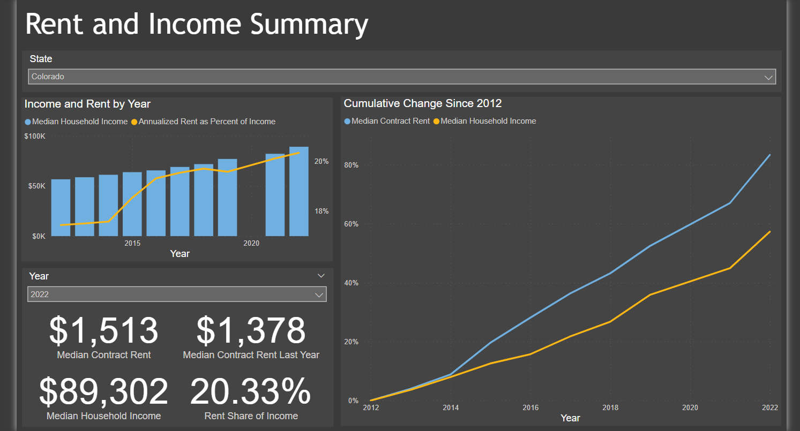

# acs1-dashboard
This is a small practice project I conducted to fetch data from the American Community Survey Detailed 1 Year Estimate tables provided by the U.S. Census, ingest this data into a SQL database, and then query the data from PowerBI to display some interesting/fun metrics in a dashboard.  

# Steps

 - **Fetch ACS Data and Write Data to Personal MySQL Database**
	 - This step all happens in the main.py script
	 - The main.py file reads user inputs set forth in the config.yaml file, which is  how it knows which ACS variables to grab
	 - It will then use the Census provided api to obtain data for each variable on all states, for all years between the user defined start year and the current year
	 - In addition to grabbing the user defined variables (based on variable code), it also and separately will grab metadata on those variable codes so we know what the common names and descriptions are for any variables it fetches
	 - The script houses these data fetch results as pandas dataframes, and writes each dataframe to the appropriate table in my MySQL database. 
		 - Note: Due to the relatively small amount of data we are fetching and writing each time, this process is refetching data that may already exist in the MySQL database for a given variable/year/state and overwriting it each time the script is executed. For larger more complex processes this approach may be suboptimal.

- **ACS 1 Dashboard**
	- Example of the dashboard contents: 
		  
		  
	- The actual dashboard is a PowerBI dashboard, this .pbix file can be found in the repo and downloaded locally to be interacted with. Note the data connections to my personal MySQL databases will not be refreshable, as I do not pay for cloud hosting for these data sources. I also do not pay for a personal PowerBI license, so this dashboard is not currently published to the web in a shareable format, which is why you must download the actual desktop file to interact with it. The goal of this project was simply to show what you could do/publish somewhere that pays for that kind of hosting. 
	- Because I do not have a PowerBI license, I was limited in this example dashboard to only the default visualizations, which lack functionality for some things like color scale legends for maps which I would have liked to have included. A work-around for this could have been generating the maps in Python which allows me to have greater control over the contents and formats, and saving them as images, hosting those images online publicly, then creating a table that contains a year field and image url field, which would have allowed me to display the image in the dashboard and still filter by year. However, that would have created more moving pieces than I felt necessary in this practice project.

